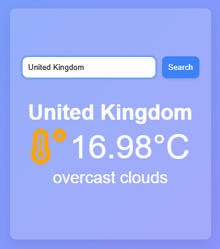

# 🌤️ React Weather App

## 🔗 Live Demo

https://react-weather-app-murex-nine.vercel.app

---

A modern and responsive weather application built with React.
Users can search for any city and instantly see the current weather information using the OpenWeather API.

## 🚀 Features

* Search weather by city name
* Real-time weather data
* Loading spinner while fetching data
* Error handling for invalid city names
* Enter key support for quick search
* Auto focus on input field
* Responsive and clean UI
* Glassmorphism design
* Smooth hover and focus effects

## 🛠️ Technologies Used

* React.js
* JavaScript (ES6+)
* CSS3
* OpenWeather API
* React Icons

## 📚 What I Practiced

* React Hooks (`useState`, `useRef`)
* API requests with `fetch`
* Async / Await
* Try / Catch / Finally
* Conditional Rendering
* Error Handling
* Loading State Management
* Controlled Inputs
* Responsive Design
* Modern UI Styling

## 📷 Screenshots



## ⚙️ Installation

```bash
git clone YOUR_GITHUB_REPO_LINK
```

```bash
cd weather-app
```

```bash
npm install
```

```bash
npm run dev
```

## 🌎 API

This project uses the OpenWeather API:

https://openweathermap.org/api

## 👨‍💻 Author

Yusuf

